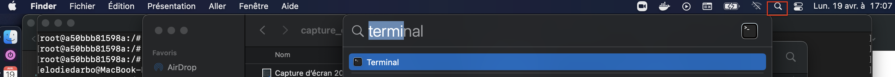

# A RShiny application to explore integrated omics data in t-cell activation context

## Requirements

### Install Docker:

For MacOS: https://docs.docker.com/docker-for-mac/install/

If you are not familiar with command lines, I recommend using the Docker Desktop which provide a user friendly interface.

For Linux: https://docs.docker.com/engine/install/ubuntu/

### Linked data

To run the application, you need to have access to the data that are not published yet.

## Usage

### Get the application from Docker Hub

Open a terminal and copy/paste/enter the following line to download the docker image from Docker Hub

`docker pull eloho/chic_tcell_activ_app:latest`

### Lauching application using command line

Open a terminal and go to the folder containing the data and scripts folders. 

`docker run --name=chic_app --memory=4g --rm -d -v $PWD/data:/data -v $PWD/scripts:/scripts  -p 3838:3838 eloho/chic_tcell_activ_app:latest`

The application is now ready to use. You can click on the link bellow or copy/paste this address in you favorite web navigator:

[http://localhost:3838](http://localhost:3838)

### Launching application using Docker Desktop

Open the Docker Desktop. 

The application appears in your local image list.

Change settings to increase the memory to 4GB (this should be sufficient). 

Once the changes have been applied, the setting page is closed and you get back to the images list.

Click on the 'run' button next to the image name. 

A popup window appears, you will create a container where the application will be launched. Expand the 'Optional Settings'.

Give a name to the container (e.g. chic_app) and indicate the local host exposed port (i. e. 3838).

Link the folder containing the data in your computer to the container directory /data.

Add a new directory by clicking the + button. to be linked and make the same operation to link the scripts folder to the container directory /scripts

Now you can click 'Run'.

Go to the Containers / Apps window, the container appears and is running (a little green container is displayed).

Clicking on it will open a few more tables that can be useful if you need to share any troubles encountered using the app. Indeed, in the LOGS tab, some R outputs are written meanwhile using the app.

The INSPECT tab just indicates some info about the container environment, and the STATS tab shows you in real time the memory usage.

The application is now ready to use. You can click on the link bellow or copy/paste this address in you favorite web navigator

[http://localhost:3838](http://localhost:3838)

You have now a bit of time to read the introduction in the 'Acceuil' tab while the data are loaded.

**NB**: While. running the app, the screen can become grey-ish and the app does not respond anymore. Check then on the 'Containers/Apps' tab. If the container is grey with a message EXITED (137), you may need to increase the accessible memory to 5 GB.

### Citation

##### R packages used to build the RShiny app

GenomicRanges: Lawrence M, Huber W, Pagès H, Aboyoun P, Carlson M, et al. (2013) Software for Computing and Annotating Genomic Ranges. PLoS Comput Biol 9(8): e1003118. doi:10.1371/journal.pcbi.1003118

data.table: Matt Dowle and Arun Srinivasan (2021). data.table: Extension of `data.frame`. R package version 1.14.0. https://CRAN.R-project.org/package=data.table

ggplot2: H. Wickham. ggplot2: Elegant Graphics for Data Analysis. Springer-Verlag New York, 2016.

plotly: C. Sievert. Interactive Web-Based Data Visualization with R, plotly, and shiny. Chapman and Hall/CRC Florida, 2020.

ggrepel: Kamil Slowikowski (2021). ggrepel: Automatically Position Non-Overlapping Text Labels with 'ggplot2'. R package version 0.9.1. https://CRAN.R-project.org/package=ggrepel

RColorBrewer: Erich Neuwirth (2014). RColorBrewer: ColorBrewer Palettes. R package version 1.1-2. https://CRAN.R-project.org/package=RColorBrewer
  
grr: Craig Varrichio (2016). grr: Alternative Implementations of Base R Functions. R package version 0.9.5. https://CRAN.R-project.org/package=grr

pheatmap: Raivo Kolde (2019). pheatmap: Pretty Heatmaps. R package version 1.0.12. https://CRAN.R-project.org/package=pheatmap

Cairo: Simon Urbanek and Jeffrey Horner (2020). Cairo: R Graphics Device using Cairo Graphics Library for Creating High-Quality Bitmap (PNG, JPEG, TIFF), Vector (PDF, SVG, PostScript) and Display (X11 and Win32) Output. R package version 1.5-12.2. https://CRAN.R-project.org/package=Cairo

shiny: Winston Chang, Joe Cheng, JJ Allaire, Carson Sievert, Barret Schloerke, Yihui Xie, Jeff Allen, Jonathan McPherson, Alan Dipert and Barbara Borges (2021). shiny: Web Application Framework for R. R package version 1.6.0. https://CRAN.R-project.org/package=shiny

shinythemes: Winston Chang (2021). shinythemes: Themes for Shiny. R package version 1.2.0. https://CRAN.R-project.org/package=shinythemes

shinycssloaders: Andras Sali and Dean Attali (2020). shinycssloaders: Add Loading Animations to a 'shiny' Output While It's Recalculating. R package version 1.0.0. https://CRAN.R-project.org/package=shinycssloaders

DT: Yihui Xie, Joe Cheng and Xianying Tan (2021). DT: A Wrapper of the JavaScript Library 'DataTables'. R package version 0.17. https://CRAN.R-project.org/package=DT

shinybusy: Fanny Meyer and Victor Perrier (2020). shinybusy: Busy Indicator for 'Shiny' Applications. R package version 0.2.2. https://CRAN.R-project.org/package=shinybusy

##### Public data 

[GSE116695](https://www.ncbi.nlm.nih.gov/geo/query/acc.cgi?acc=GSE116695) : Yukawa M, Jagannathan S, Vallabh S, Kartashov AV et al. AP-1 activity induced by co-stimulation is required for chromatin opening during T cell activation. J Exp Med 2020 Jan 6;217(1). PMID: 31653690

[GSE62486](https://www.ncbi.nlm.nih.gov/geo/query/acc.cgi?acc=GSE62486): Hertweck A, Evans CM, Eskandarpour M, Lau JC et al. T-bet Activates Th1 Genes through Mediator and the Super Elongation Complex. Cell Rep 2016 Jun 21;15(12):2756-70. PMID: 27292648

[GSE138767](https://www.ncbi.nlm.nih.gov/geo/query/acc.cgi?acc=GSE138767): Yang J, McGovern A, Martin P, Duffus K et al. Analysis of chromatin organization and gene expression in T cells identifies functional genes for rheumatoid arthritis. Nat Commun 2020 Sep 2;11(1):4402. PMID: 32879318
